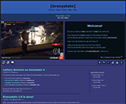
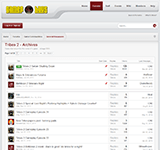

---
# Resume
# Last updated on
date: 2016-04-05
# All link references at end of document
---
<i class="fa fa-star"></i><i class="fa fa-star-o"></i><i class="fa fa-star-o"></i>
<i class="fa fa-star"></i><i class="fa fa-star"></i><i class="fa fa-star-o"></i>
<i class="fa fa-star"></i><i class="fa fa-star"></i><i class="fa fa-star"></i>

<!-- Picture Credit: ASUKA Q by Naoto Ikeda, minor alterations by Shizuka Kamishima -->

# Shizuka Kamishima

## Developer // Community Manager

Twin Cities, MN

 - IRC moderation since 2007
 - Broad programming expertise
 - Enthusiastic fast learner
 - Highly adaptable

================================================================================

# Skills
* * *

## User Interaction {{lv3}}
 - Extended experience interacting with users as IRC moderator
 - High comment karma on Reddit for insight into widely varied user questions
 - Maintains friendly atmosphere throughout interaction
 - Tries to identify and address core issues as fast as possible
 - Understands and explains complex concepts by drilling through abstractions

## Java {{lv3}}
 - Built cross-platform terminal applications, limited GUI experience
 - Applied design patterns to construct [IRC chatbot][hikaribot]
 - [SQLite database][hb-sqlite] used for same bot
 - [Twitter API integration][hb-twitter] on same bot
 - Some experience integrating third-party libraries
 
## PHP {{lv2}}
 - Built some simple CMS platforms for previous generations of this site
 - Created [Wordpress plugins][brst2embed] for site administration
 - Solid understanding of HTTP requests and serverside handling
 - Limited database experience with PHP

## Web Frontend {{lv2}}
 - Extensive experience building simple sites like [This Vortal Cord](/)
 - Languages: HTML, CSS, SASS, Markdown
 - Some use of CSS Transitions
 - Advanced experience with Jekyll static site generator
 - Limited JavaScript experience

## Web Backend {{lv2}}
 - Solid understanding of OSI stack
 - Working knowledge of DNS, routing and switching protocols, network design
 - Have operated own Linux web server with Apache and nginx
 - Limited experience in database administration

## Version Control {{lv2}}
 - Git used for development projects
 - Experience mostly in GitHub Desktop GUI
 - Understanding of backend mechanics of distributed version control
 - Prior experience using Mercurial and SVN

## Microsoft Office {{lv2}}
 - Advanced experience in Word, Excel, PowerPoint
 - Limited usage since 2010
 - Typically use Markdown for documents, Google Sheets for spreadsheets

## JavaScript {{lv1}}
 - Built [simple countdown timer script][brsttimer] using Moment.js
 - Understanding of JS object composition
 - Exposure to Node.js, no experience yet in using it
 - Built AJAX page content retrieval script before experience in PHP

## Interface Design {{lv1}}
 - Prefer simple layouts with minimal embellishment
 - Have designed CSS layouts with simple columns, not grids
 - Limited experience with responsive design

================================================================================

# Experience
* * *

## [Bronystate](http://www.bronystate.net) {#bronystate}

### Technical Supervisor / 2011-present

Bronystate is an IRC community for the *My Little Pony: Friendship is Magic*
fandom (bronies), founded in May 2011. Their focus is video streaming, with
movies on weekends and live streams of new episodes during the season. They
boast a vibrant, global userbase, reaching tens of thousands annually.

#### Highlights
 - Built and deployed [Jekyll-based site][brst3repo] in 2015
 - Daily interaction with diverse community over many years
 - Deployed Wordpress installation for long-delayed site upgrade in 2012
 - Built and deployed [embed switching Wordpress plugin][brst2embed]
 - Produced [Bronystate Intermission 2.0][brstint] for use during movie nights
 - Produced [The First Annual Tom Awards][tom2012] video with staff in 2012
 - Produced [The Second Annual Tom Awards][tom2013] video with staff in 2013

* * *

## [World of Minecraft](http://www.worldofminecraft.com) {#wom}

### Moderator / 2010-2011

World of Minecraft was a Minecraft Classic server network, before the addition
of multiplayer to the Alpha version of the game. They maintained several servers
that attracted many talented builders. During peak hours, there would be
hundreds of players from around the world.

The IRC community fell apart in late 2011, and the site legacy was carried on by
some former staff. It exists today as a community focused on one server.

#### Highlights
 - Oversaw hundreds of simultaneous users in Minecraft Classic
 - Used staff inspection tools to detect and revert damage to user creations
 - Interacted with regular community members on IRC

* * *

## [Goon Haven](http://gamer.haus) {#goonhaven}

### Community Architect / 2009-2010

Goon Haven was one of several Tribes 2 server communities to appear shortly
after the release of TribesNext in early 2009, rapidly becoming the most
consistently populated server in the list for the duration of the game's
revival.

When Tribes 2's popularity declined between 2010-2012, the site rebranded as
Gamer Haus and branched out to hosting other games and groups. The site exists
now as a frontend for their Discord chat server.

#### Highlights
 - Fast-paced game server administration of up to 64 simultaneous players
 - Established clear community rules, which remained long after my departure
 - Founded community IRC channel, including setup of IRC services
 - Helped testing IRC bot that integrated with game server
 - Helped testing experimental Tribes 2 game mods

================================================================================

# Volunteer Work

 - [Wrote book review][bkreview] for *My Little Brony: An Unofficial Novel About
   The Magic of Friendship* at publisher request
 - Assisted in early draft editing for *Minecraft For Kids* by Packt Publishing,
   though the project seems to have been abandoned
 - Reimaged a few dozen workstations at *The Saint Paul Foundation*

[hikaribot]: https://github.com/shizuka/hikaribot/
[hb-sqlite]: https://github.com/shizuka/hikaribot/blob/banhammer/src/sk/hikaribot/banhammer/api/BanDatabase.java
[hb-twitter]: https://github.com/shizuka/hikaribot/blob/master/src/sk/hikaribot/twitter/TwitBot.java
[brst]: http://www.bronystate.net
[brst3repo]: https://github.com/Bronystate/brstv3
[brsttimer]: https://github.com/Bronystate/brstv3/blob/master/assets/js/brst-countdowns.js
[brst2embed]: https://bitbucket.org/shizuka/sk-bs-theater/
[tom2012]: https://www.youtube.com/watch?v=4jNBQ-_4zlo
[tom2013]: https://www.youtube.com/watch?v=pGUXxjkLo2A
[brstint]: https://www.youtube.com/watch?v=zmBlxzbLj5s
[bkreview]: /writing/blog/2015-05-20-my-little-brony-review.html
